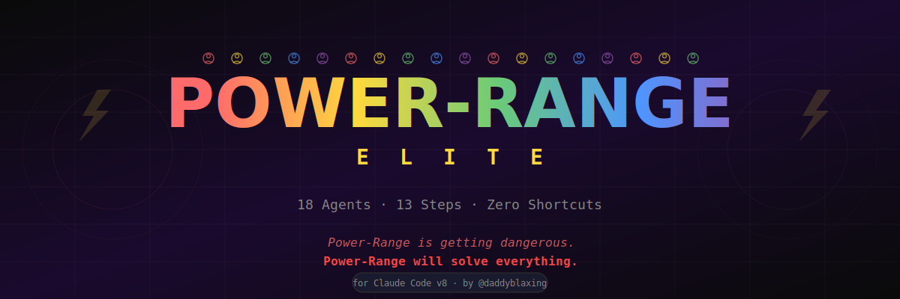

<p align="center">
  
</p>

<h1 align="center">POWER-RANGE ELITE</h1>

<p align="center">
  <strong>18 AI Agents. 13-Step Quality Pipeline. Zero Shortcuts.</strong>
</p>

<p align="center">
  
  
  
  
</p>

<p align="center">
  <em>Power-Range is getting dangerous.<br/>Power-Range will solve everything.</em>
</p>

---

## What is Power-Range?

Power-Range Elite turns Claude Code into a **full engineering team** that runs a 13-step quality pipeline on every task you give it. Instead of one AI writing code and hoping it works, Power-Range spawns **18 specialized agents** — each with a specific role, clear responsibilities, and zero tolerance for shortcuts.

Every feature goes through:
- Failure simulation **before** a single line of code is written
- Parallel build with an adversarial reviewer watching
- Independent cold review by 5 agents who never saw the build process
- Live application testing with real clicks and screenshots
- A Tech Lead who only signs off when **everything** passes

**It's not a prompt. It's a pipeline.**

---

## The 18 Agents

```
  ┌─────────────────────────────────────────────────────┐
  │                  CTO ORCHESTRATOR                    │
  │           Controls the entire pipeline               │
  └──────────────────────┬──────────────────────────────┘
                         │
  ┌──────────────────────▼──────────────────────────────┐
  │              DISCOVERY PHASE                         │
  │  Bookkeeper ─── Prompt Translator ─── What-If Agent │
  │  (memory)        (precision)          (predict fail) │
  └──────────────────────┬──────────────────────────────┘
                         │
  ┌──────────────────────▼──────────────────────────────┐
  │              ARCHITECTURE                            │
  │                  Architect                            │
  │        (plan with pre-emptive fixes)                 │
  └──────────────────────┬──────────────────────────────┘
                         │
  ┌──────────────────────▼──────────────────────────────┐
  │           BUILD WAVE (parallel)                      │
  │  Backend Engineer ─── Frontend Engineer              │
  │           └────── Challenger ──────┘                 │
  │                (adversarial watch)                    │
  └──────────────────────┬──────────────────────────────┘
                         │
  ┌──────────────────────▼──────────────────────────────┐
  │              INTEGRATION                             │
  │  Integration Engineer ─── Role & Access Engineer     │
  │  (end-to-end chain)       (permissions from rules)   │
  └──────────────────────┬──────────────────────────────┘
                         │
  ┌──────────────────────▼──────────────────────────────┐
  │       INDEPENDENT REVIEW (5 agents, parallel)        │
  │  QA ─ Code Review ─ Security ─ Coverage ─ KPI       │
  │         (cold context — zero prior knowledge)        │
  └──────────────────────┬──────────────────────────────┘
                         │
  ┌──────────────────────▼──────────────────────────────┐
  │              FINALIZATION                             │
  │  Documentation ─── Tech Lead ─── Tester              │
  │                  (final gate)   (live app testing)   │
  └─────────────────────────────────────────────────────┘
```

| # | Agent | Role |
|---|-------|------|
| 1 | **CTO** | Orchestrates the full pipeline, detects loops, manages session |
| 2 | **Bookkeeper** | Permanent architecture memory — knows every file and danger zone |
| 3 | **Prompt Translator** | Converts vague requests into precise technical specs |
| 4 | **What-If Agent** | Simulates every failure mode before code is written |
| 5 | **Architect** | Plans implementation with pre-emptive fixes for every risk |
| 6 | **Backend Engineer** | Builds server-side logic with multi-tenancy enforcement |
| 7 | **Frontend Engineer** | Builds UI with loading, error, and empty states on everything |
| 8 | **Challenger** | Adversarial reviewer — assumes mistakes were made, finds them |
| 9 | **Integration Engineer** | Verifies the full end-to-end chain actually works |
| 10 | **Role & Access Engineer** | Enforces permissions from business rules, not assumptions |
| 11 | **QA Engineer** | Independent testing — Silent Failure Hunt runs first |
| 12 | **Code Reviewer** | Cold review with zero prior context |
| 13 | **Security Sentinel** | Runs actual security commands, not checklists |
| 14 | **Test Coverage Engineer** | Enforces 70% threshold, regression tests for every bug |
| 15 | **Business KPI Analyst** | Verifies calculations match business rules exactly |
| 16 | **Documentation Engineer** | Inline docs and change summaries |
| 17 | **Tech Lead** | Final quality gate — signs off only when everything passes |
| 18 | **Tester** | Launches real app, clicks real features, takes screenshots |

---

## Installation

### Requirements

- **Claude Code v8+** (CLI, Desktop App, or IDE Extension)
- Claude **Max** or **Pro** plan (agents need token capacity)

### One-Line Install

**Mac / Linux / Git Bash on Windows:**
```bash
git clone https://github.com/MEHDIGAMER/power-range-elite.git && cd power-range-elite && bash install.sh
```

**Windows PowerShell:**
```powershell
git clone https://github.com/MEHDIGAMER/power-range-elite.git; cd power-range-elite; .\install.ps1
```

### Manual Install

If you prefer to do it yourself:

1. Copy everything in `commands/` to `~/.claude/commands/`
2. Copy everything in `agents/` to `~/.claude/agents/`
3. Done.

```bash
cp commands/*.md ~/.claude/commands/
cp agents/*.md ~/.claude/agents/
```

---

## Setup Status

When you run the installer, you'll see:

```
[1/6] Checking prerequisites...
  + Claude Code CLI detected
  + Claude directory found

[2/6] Preparing directories...
  + ~/.claude/commands
  + ~/.claude/agents

[3/6] Installing Power-Range commands...
  + /power-load installed
  + /power-range installed
  + /power-range-escalate installed

[4/6] Deploying 18 elite agents...
  + [ 1/18] CTO Orchestrator
  + [ 2/18] Bookkeeper (Architecture Memory)
  + [ 3/18] Prompt Translator
  + [ 4/18] What-If Agent (Failure Simulator)
  + [ 5/18] Architect (Technical Planner)
  + [ 6/18] Backend Engineer
  + [ 7/18] Frontend Engineer
  + [ 8/18] Challenger (Adversarial Reviewer)
  + [ 9/18] Integration Engineer
  + [10/18] Role & Access Engineer
  + [11/18] Security Sentinel
  + [12/18] Test Coverage Engineer
  + [13/18] QA Engineer
  + [14/18] Code Reviewer
  + [15/18] Business KPI Analyst
  + [16/18] Tester (Live App Testing)
  + [17/18] Documentation Engineer
  + [18/18] Tech Lead (Final Gate)

[5/6] Verifying installation...
  ✓ All files verified

[6/6] Installation complete!

  Power-Range is getting dangerous.
  Power-Range will solve everything.
```

---

## How to Use

### Step 1: Install on Your Project

Open Claude Code in your project directory and type:

```
/power-load
```

This runs a one-time setup that:
- Scans your entire codebase
- Interviews you about your product, roles, and business rules
- Generates 6 project files (`PRD.md`, `BOOKKEEPER.md`, `BUSINESS-RULES.md`, `SESSIONS.md`, `MISTAKES.md`, `.power-range/config.md`)
- Optionally sets up CI/CD

### Step 2: Run the Pipeline

Type `/power-range` followed by what you want:

```
/power-range Add a dashboard page that shows revenue per model with filters by date range
```

```
/power-range Fix the login bug where users get a white screen after OAuth redirect
```

```
/power-range Review the payment processing module for security issues
```

The CTO agent takes over and runs the full 13-step pipeline automatically.

### Step 3: Escalate (if needed)

If Power-Range delivers code that doesn't work:

```
/power-range-escalate
```

This sends the failing code to **4 different AI models** (GPT-4o, Gemini, DeepSeek, Grok) for independent diagnosis. You get a consensus verdict and a targeted fix.

---

## The 13-Step Pipeline

| Step | What Happens | Why It Matters |
|------|-------------|----------------|
| 0 | Read all project files | Full context before any decision |
| 1 | Mode detection | BUILD / FIX / REVIEW / MIGRATE / LIGHTWEIGHT |
| 2 | Intake interview | Clarify unknowns, write Session Spec |
| 3 | Bookkeeper brief | Architecture context, danger zones |
| 4 | Prompt translation | Precise technical brief, zero ambiguity |
| 5 | What-If simulation | Find every failure before writing code |
| 6 | Architecture plan | Implementation plan with pre-emptive fixes |
| 7 | Parallel build | Backend + Frontend + Challenger watching |
| 8 | Integration + Access | End-to-end chain + role enforcement |
| 9 | Independent review | 5 cold agents reviewing simultaneously |
| 10 | Documentation | Inline docs + change summary |
| 11 | Tech Lead sign-off | Final quality gate |
| 12 | Live testing | Real app, real clicks, real verification |
| 13 | Session close | Update all project memory files |

---

## Features

- **Multi-Tenancy Enforcement** — Every agent checks tenant isolation. If active, every query must include `tenant_id`. No exceptions.
- **Audit Logging** — Every write to audited entities is logged with who, when, what, old value, new value.
- **Silent Failure Hunting** — QA specifically searches for errors caught but never shown to users.
- **Loop Detection** — CTO monitors for edit loops, repeated errors, scope creep, and conflicting implementations.
- **Mistake Memory** — Every mistake is logged and read by all agents in future sessions. The same bug never happens twice.
- **Escalation Protocol** — When Power-Range fails, 4 external AI models diagnose the issue independently.

---

## File Structure

After `/power-load`, your project gets:

```
your-project/
├── PRD.md                    # Product requirements
├── BOOKKEEPER.md             # Architecture map (auto-updated)
├── BUSINESS-RULES.md         # Role permissions, calculations, rules
├── SESSIONS.md               # Session history log
├── MISTAKES.md               # Mistake patterns (auto-updated)
└── .power-range/
    ├── config.md             # Project config for agents
    └── session/              # Current session artifacts
        ├── 01-bookkeeper-brief.md
        ├── 02-technical-brief.md
        ├── 03-whatif-report.md
        ├── 04-implementation-plan.md
        ├── 05-backend-handoff.md
        ├── 06-frontend-handoff.md
        ├── 07-challenger-review.md
        ├── 08-integration-handoff.md
        ├── 09-role-access-check.md
        ├── 10-qa-report.md
        ├── 11-code-review.md
        ├── 12-security-report.md
        ├── 13-coverage-report.md
        ├── 14-kpi-report.md
        ├── 15-docs-summary.md
        ├── 16-tech-lead-decision.md
        └── 17-tester-report.md
```

---

## FAQ

**Q: Does this work with Claude Code Desktop / Web / VS Code?**
A: Yes. Power-Range uses slash commands and agents, which work everywhere Claude Code runs.

**Q: How many tokens does a full pipeline use?**
A: A full BUILD session uses roughly 200-400k tokens depending on project size. LIGHTWEIGHT mode uses ~35% of that.

**Q: Can I use this with any project?**
A: Yes. `/power-load` adapts to your stack. It works with React, Next.js, Vue, Svelte, Node.js, Python, Electron, Firebase, and more.

**Q: What if I only need a quick fix?**
A: Power-Range auto-detects LIGHTWEIGHT mode for simple changes (typo, config value, copy change) and only spawns 3 agents instead of 18.

**Q: Do I need API keys for the escalation command?**
A: Yes. `/power-range-escalate` calls GPT-4o, Gemini, DeepSeek, and Grok. Set `OPENAI_API_KEY`, `GEMINI_API_KEY`, `DEEPSEEK_API_KEY`, and `XAI_API_KEY` as environment variables.

---

<p align="center">
  <strong>Power-Range is getting dangerous.</strong><br/>
  <strong>Power-Range will solve everything.</strong>
</p>

<p align="center">
  <em>Built by <a href="https://github.com/MEHDIGAMER">@daddyblaxing</a></em>
</p>
